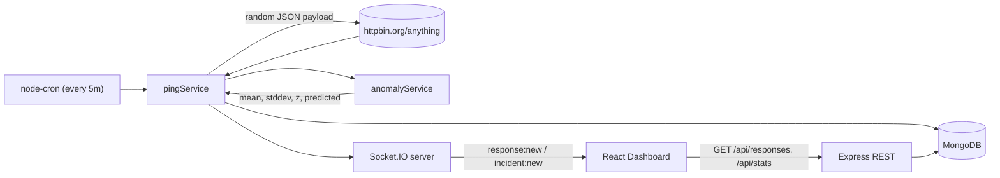

# BizScout HTTP Monitor

A full-stack application that monitors HTTP responses from `httpbin.org/anything` every 5 minutes, stores them in MongoDB, streams live updates to a React dashboard, and automatically detects anomalies via z-score + 2× mean threshold with an EWMA forecaster overlay.

Built as the BizScout Engineering take-home assessment.

---

## Table of Contents

1. [Architecture](#architecture)
2. [Tech Choices & Reasoning](#tech-choices--reasoning)
3. [Local Setup](#local-setup)
4. [Environment Variables](#environment-variables)
5. [Running Tests](#running-tests)
6. [Core Components & Testing Strategy](#core-components--testing-strategy)
7. [Continuous Integration](#continuous-integration)
8. [Deployment](#deployment)
9. [Database Schema](#database-schema)
10. [Assumptions](#assumptions)
11. [Trade-offs](#trade-offs)
12. [Future Improvements](#future-improvements)

---

## Architecture

```
bizscount-assessment/
├── backend/                 Express + TypeScript + Mongoose + Socket.IO
│   ├── src/
│   │   ├── config/          zod-validated env
│   │   ├── db/              Mongoose connection
│   │   ├── models/          Response schema
│   │   ├── services/        pingService, anomalyService, scheduler
│   │   ├── sockets/         Socket.IO bootstrap + emit helpers
│   │   ├── routes/          /api/responses, /api/stats
│   │   ├── middleware/      error + 404 handlers
│   │   ├── utils/           pino logger
│   │   └── __tests__/       Jest + Supertest + mongodb-memory-server + nock
│   ├── render.yaml          Render deployment blueprint
│   └── package.json
├── frontend/                React + Vite + TypeScript + Tailwind + Recharts
│   ├── src/
│   │   ├── pages/           Dashboard, Anomalies
│   │   ├── components/      ResponsesTable, AnomalyChart, StatsBar, …
│   │   ├── hooks/           useSocket (auto-reconnecting Socket.IO client)
│   │   ├── store/           Zustand store for live response list
│   │   ├── lib/             typed fetch API client
│   │   └── types/           shared DTOs
│   ├── vercel.json          Vercel SPA config
│   └── package.json
├── .github/workflows/ci.yml GitHub Actions CI (lint + test + coverage + build)
├── docker-compose.yml       Local Docker stack for MongoDB + backend + frontend
└── README.md
```

### Data flow



Every 5 minutes (configurable via cron), the backend generates a random JSON payload with `@faker-js/faker`, POSTs it to `httpbin.org/anything`, records the response time, evaluates it against the last 24h of data via z-score and 2× mean rules, computes an EWMA forecast for the next expected response time, persists the enriched row, and broadcasts it over Socket.IO. Browsers subscribed to the socket see new rows prepended to the table instantly; the Anomalies page renders actual vs predicted response time with a μ ± 2σ confidence band and red dots on anomalies.

---

## Tech Choices & Reasoning

| Layer | Choice | Why |
|---|---|---|
| Backend framework | **Express 4 + TypeScript** | Lightweight, battle-tested, the brief's preferred stack. TS gives type safety at API + DB boundaries. |
| Realtime | **Socket.IO** | Auto-reconnect, fallback transports, and trivial room/event APIs. Works over Render's free tier. |
| Scheduler | **node-cron** | Simple and reliable for single-instance cron. Swapped out for BullMQ/Agenda if we scale horizontally. |
| Database | **MongoDB** via **Mongoose** | The target endpoint (`httpbin.org/anything`) echoes arbitrary client-sent JSON back; the response shape is inherently variable. A schemaless document store avoids brittle migrations and stores the full payload verbatim. Aggregation (`$avg`, `$stdDevPop`, `$match` on time window) handles rolling statistics in-DB. |
| Validation | **Zod** | Single source of truth for env vars and query params; runtime + static types for free. |
| Logging | **pino + pino-http** | Structured JSON logs, near-zero-overhead, with `pino-pretty` for local DX. |
| Frontend framework | **React 18 + Vite + TS** | Vite's instant HMR, modern bundling, and TS template are ideal. |
| Server state | **TanStack Query** | Deduped fetching, caching, `invalidateQueries` triggered on socket events. |
| UI state | **Zustand** | Tiny, boilerplate-free store for the live response list. |
| Styling | **Tailwind CSS** | Fast, responsive layout without hand-rolling CSS. |
| Charting | **Recharts** | Declarative, composes the band (`ReferenceArea`), actual/predicted (`Line`), and anomaly markers (`Scatter`) in one chart. |
| Testing | **Jest + ts-jest + Supertest + nock + mongodb-memory-server** (backend), **Vitest + React Testing Library** (frontend) | In-memory Mongo keeps tests hermetic and fast; `nock` stubs httpbin deterministically. |

### Why MongoDB and not Postgres?

The brief invites us to justify the choice. We chose **Mongo** because:

1. **Variable response shape.** httpbin reflects whatever JSON we send it, plus varying headers/args. Storing `responseBody` as a JSONB blob in Postgres is possible but Mongo keeps this as the primary data model, so indexing and querying subfields of the response is natural.
2. **Aggregation fits the workload.** Rolling window stats with `$stdDevPop` are one-liners in Mongo and execute entirely in the DB. In Postgres, we'd need `stddev_pop()` plus a time-window `WHERE` clause, which is also fine — but Mongo's pipeline composes more cleanly for the future "detect by endpoint/tag" extensions.
3. **Free Atlas M0 tier** is a one-click deploy with no ops burden.

A SQL choice would have been defensible too; the trade-off we accept is the lack of strong schema enforcement (mitigated by the Mongoose schema + TS types).

---

## Local Setup

### Prerequisites

- Node.js **20+**
- npm **10+**
- Docker (optional, for the full local stack) OR a MongoDB Atlas connection string

### 1. Clone and install

```bash
git clone <repo-url> bizscount-monitor
cd bizscount-monitor

cd backend && npm install && cd ..
cd frontend && npm install && cd ..
```

### 2. Run everything with Docker

The repository includes:

- `backend/Dockerfile`
- `frontend/Dockerfile`
- `docker-compose.yml`

To boot MongoDB, the backend API, and the frontend dashboard together:

```bash
docker compose up --build
```

Services:

- frontend: [http://localhost:5173](http://localhost:5173)
- backend: [http://localhost:4000](http://localhost:4000)
- mongo: `mongodb://localhost:27017/bizscout`

The compose setup mounts `backend/` and `frontend/` into their containers for local development and keeps container-only `node_modules` volumes so installs remain isolated from your host machine.

Stop everything with:

```bash
docker compose down
```

### 3. Run MongoDB only

**Option A — Docker (recommended for local dev):**

```bash
docker compose up -d mongo
```

This boots Mongo 7 on `mongodb://localhost:27017/bizscout` with a persistent volume.

**Option B — MongoDB Atlas:** Create a free M0 cluster and copy the connection string.

### 4. Configure env for manual local runs

```bash
cp backend/.env.example backend/.env
cp frontend/.env.example frontend/.env
```

Edit `backend/.env` and set `MONGO_URI` if using Atlas.

### 5. Run the app manually (two terminals)

```bash
# terminal 1 — backend (http://localhost:4000)
cd backend && npm run dev

# terminal 2 — frontend (http://localhost:5173)
cd frontend && npm run dev
```

Use this manual flow if you are not running the full Docker stack.

The scheduler fires immediately on boot and then every 5 minutes. To trigger a ping on demand during development, hit the dev-only endpoint:

```bash
curl -X POST http://localhost:4000/admin/trigger
```

---

## Environment Variables

### Backend (`backend/.env`)

| Variable | Default | Purpose |
|---|---|---|
| `PORT` | `4000` | HTTP + Socket.IO port |
| `NODE_ENV` | `development` | `development` \| `test` \| `production` |
| `MONGO_URI` | `mongodb://localhost:27017/bizscout` | Mongo connection string |
| `PING_TARGET_URL` | `https://httpbin.org/anything` | Endpoint to probe |
| `PING_INTERVAL_CRON` | `*/5 * * * *` | cron schedule (5 min) |
| `PING_TIMEOUT_MS` | `10000` | axios timeout |
| `CORS_ORIGIN` | `*` | Comma-separated allow-list (set to your Vercel URL in prod) |
| `LOG_LEVEL` | `info` | pino level |
| `ANOMALY_WINDOW_HOURS` | `24` | Rolling window for stats |
| `ANOMALY_Z_THRESHOLD` | `3` | \|z\| above this flags an anomaly |
| `ANOMALY_MIN_SAMPLES` | `10` | Minimum samples before the detector engages |
| `EWMA_ALPHA` | `0.3` | EWMA smoothing factor |
| `RESPONSE_TTL_DAYS` | `30` | Auto-delete responses older than N days (Mongo TTL index). 0 disables. |
| `API_KEY` | *(unset)* | Shared secret required on `X-API-KEY` header (REST) and Socket.IO handshake `auth.apiKey`. **Required in production**; if unset in dev/test, auth is a no-op. Must be ≥ 16 chars. |

### Frontend (`frontend/.env`)

| Variable | Default | Purpose |
|---|---|---|
| `VITE_API_URL` | `http://localhost:4000` | REST base URL |
| `VITE_SOCKET_URL` | `http://localhost:4000` | Socket.IO URL |
| `VITE_API_KEY` | *(empty)* | Must match backend `API_KEY`. Baked into the Vite build — treat it as a shared token for this deployment, not an end-user secret. |

---

## Running Tests

```bash
# backend — Jest + ts-jest + Supertest + mongodb-memory-server + nock
cd backend
npm test                    # run once
npm run test:coverage       # with coverage report
npm run test:watch          # TDD mode

# frontend — Vitest + React Testing Library
cd frontend
npm test
npm run test:coverage
```

Backend coverage is enforced in `jest.config.js` — `anomalyService.ts` must stay ≥ 90% lines / ≥ 80% branches.

---

## Core Components & Testing Strategy

### Chosen core components

1. **`backend/src/services/anomalyService.ts`** — the statistical heart of the product. A bug here means silent false negatives (missed incidents) or alert fatigue (false positives). Tested most deeply.
2. **`backend/src/services/pingService.ts`** — the monitoring pipeline itself; if it fails to record, the system has no data.

Everything else (dashboards, pagination, CRUD) is peripheral — important, but replaceable.

### Test breakdown

| Test file | Type | What it covers |
|---|---|---|
| `anomalyService.test.ts` | Unit + integration | 18+ tests: z-score math, stddev-zero guards, non-finite inputs, threshold-only vs z-only vs combined anomalies, custom `minSamples`, zero-mean, EWMA with multiple alphas, Mongo aggregation time-window & status filtering, end-to-end `evaluateAnomaly` flow. Coverage: **100% statements, 96.55% branches**. |
| `pingService.test.ts` | Integration | Payload shape + uniqueness; stubbed httpbin (nock) with 200 / 503 / network error / delayed response; verifies Mongo persistence, Socket.IO emission spy, `incident:new` fires only on anomaly. |
| `api.test.ts` | Integration | Supertest against the real Express app + in-memory Mongo: `/health`, `/api/responses` (pagination cursor, filters, bad input), `/api/responses/:id` (found / 404 / 400), `/api/stats` (empty / aggregated / bad window). |
| `ResponsesTable.test.tsx` | Component | Loading / empty / error states; row rendering; status badge; anomaly highlighting + z-score label; byte formatting. |

### Why this breadth

The brief asks for *comprehensive tests on ONE core component* — that's `anomalyService`. Everything else is thinner but present so the CI signal is meaningful: a regression in routes or the React table still fails the build. Integration tests (Supertest + mongodb-memory-server) catch schema/route/contract issues that pure unit tests miss.

---

## Continuous Integration

GitHub Actions — [.github/workflows/ci.yml](.github/workflows/ci.yml).

- **Triggers**: push + PR on `main`.
- **Jobs**: `backend` and `frontend` run in parallel, each doing:
  1. `npm ci`
  2. `npm run lint` (ESLint)
  3. `npm run test:coverage` (Jest / Vitest with coverage thresholds)
  4. `npm run build` (tsc / Vite)
  5. Upload coverage as an artifact + optional Codecov push (no-op if `CODECOV_TOKEN` unset).
- **Concurrency group** cancels superseded runs on the same ref.
- Runtime on a cold cache: ~2 minutes per job.

---

## Deployment

All tiers are **free**.

### Live URLs

- Frontend: [https://bizscout-1.onrender.com/](https://bizscout-1.onrender.com/)
- Backend: [https://bizscout-xh0x.onrender.com](https://bizscout-xh0x.onrender.com)

### 1. MongoDB Atlas

1. Create a free-tier (M0) cluster.
2. Add a database user (username + strong password).
3. Network Access → allow `0.0.0.0/0` (acknowledged trade-off; see [Trade-offs](#trade-offs)).
4. Copy the connection string — this is your `MONGO_URI`.

### 2. Backend → Render

Option A — connect the repo and use [`backend/render.yaml`](backend/render.yaml) as a Blueprint.

Option B — manual:

1. New → Web Service → connect the GitHub repo.
2. Root Directory: `backend`
3. Build Command: `npm ci && npm run build`
4. Start Command: `node dist/index.js`
5. Health Check Path: `/health`
6. Environment: Node 20
7. Env vars (see table above). Set `CORS_ORIGIN` to your Vercel URL after step 3.

Render's free Web Services support WebSockets natively. They sleep after ~15 minutes of inactivity — for this assignment that's acceptable (the cron resumes on wake). If you want truly continuous pinging, add a free [cron-job.org](https://cron-job.org) hitting `/health` every 10 minutes.

### 3. Frontend → Vercel

1. New Project → import the repo.
2. Root Directory: `frontend`
3. Framework Preset: Vite (auto-detected; [`vercel.json`](frontend/vercel.json) also present).
4. Env vars:
   - `VITE_API_URL` = `https://<your-render-backend>.onrender.com`
   - `VITE_SOCKET_URL` = same URL
5. Deploy. Go back to Render and set `CORS_ORIGIN` to your Vercel production URL.

### Verify

```bash
curl https://<your-render-backend>.onrender.com/health
# => {"status":"ok",...}

curl https://<your-render-backend>.onrender.com/api/responses?limit=5
```

Open the Vercel URL in a browser. You should see the dashboard; after the first cron tick you'll see a row appear in real-time via WebSocket.

---

## Database Schema

Single collection `responses`:

```ts
{
  _id: ObjectId,
  url: string,
  method: string,
  requestPayload: Mixed,        // the random JSON we sent
  status: number,               // 0 on network error
  ok: boolean,
  responseTimeMs: number,
  responseSizeBytes: number,
  responseBody: Mixed,          // full httpbin echo
  headers: Mixed,
  error: string | null,
  isAnomaly: boolean,
  zScore: number | null,
  predictedResponseTimeMs: number | null,
  anomalyReason: string | null,
  createdAt: Date
}
```

Indexes:

- `{ createdAt: -1 }` — history pagination & cursor
- `{ isAnomaly: 1, createdAt: -1 }` — Anomalies page filter

---

## Assumptions

- **Single backend instance** runs the cron. If we scale horizontally, two instances would double-ping; documented as a known limitation with BullMQ/Agenda as the upgrade path.
- **No authentication** — the brief doesn't require it and the dashboard is public-read.
- **httpbin.org is public and unauthenticated** — treated as ground truth. If it's down, we record `status=0`, skip it in stats (filter `status > 0`), and continue.
- **5-minute interval** is configurable — tests override `PING_INTERVAL_CRON` via env to make CI fast.
- **Response size** is measured after JSON stringification of the parsed body (not the raw bytes on the wire). Close enough for monitoring/anomaly purposes.
- **Anomaly detection** uses the last 24h (`ANOMALY_WINDOW_HOURS`) and requires ≥ 10 samples (`ANOMALY_MIN_SAMPLES`) before it engages — avoids flagging the first minutes after boot as anomalous.

---

## Trade-offs

- **MongoDB over SQL.** Accepts weaker schema enforcement for better fit with variable JSON payloads and simpler aggregation. Mongoose + TS types keep us honest.
- **`node-cron` over BullMQ.** Simplicity over horizontal-scalability. Acceptable for a single Render instance; documented upgrade path.
- **Atlas `0.0.0.0/0` allowlist.** Render's free plan has no static outbound IPs. The production-correct fix is a paid Render plan with a reserved IP or a VPC peering setup. For this demo we use auth-only (strong password + user scoped to one DB).
- **Render free tier sleeps.** Missed cron ticks while asleep are fine for monitoring demo purposes. Mitigation: external health-check pinger.
- **Response body stored in full.** Great for debuggability, grows the DB. Mitigation (future): a TTL index to drop rows older than N days.
- **EWMA over ARIMA / Prophet.** EWMA is O(n), transparent, and has zero external deps. It won't model seasonality. For a 5-minute cadence on a public test endpoint, this is more than sufficient.

---

## Authentication

The REST API (`/api/*`, `/metrics`, `/admin/trigger`) and the Socket.IO endpoint are protected by a shared `X-API-KEY`.

- **Header (REST):** clients send `X-API-KEY: <value>`.
- **Handshake (Socket.IO):** clients pass `{ auth: { apiKey: <value> } }` to `io(url, …)`.
- **Server:** [`backend/src/middleware/auth.ts`](backend/src/middleware/auth.ts) performs a `crypto.timingSafeEqual` check; missing header → `401`, wrong key → `403`. Socket handshakes without the key are rejected at `io.use()` with a `connect_error` event on the client.
- **Public paths:** `/health`, `/health/live`, `/health/ready` stay unauthenticated so Render / Kubernetes probes keep working.
- **Dev ergonomics:** if `API_KEY` is unset, the middleware is a no-op. Startup validation in [`config/env.ts`](backend/src/config/env.ts) forces `API_KEY` to be present (and ≥ 16 chars) when `NODE_ENV=production`, so a misconfigured deploy fails to boot instead of silently running open.
- **CORS:** `X-API-KEY` is explicitly added to `Access-Control-Allow-Headers` so browser preflights succeed behind proxies that don't reflect request headers.
- **Frontend note:** `VITE_API_KEY` is embedded in the built JS. Rotate it by redeploying both tiers together; don't treat it as a per-user secret.

Generate a key:

```bash
node -e "console.log(require('crypto').randomBytes(32).toString('hex'))"
```

## Production-Readiness Extras

Beyond the core brief, the backend includes a few touches commonly expected in production:

- **Distributed scheduler lock** ([backend/src/services/lock.ts](backend/src/services/lock.ts)). A Mongo-backed TTL lock in the `schedulerlocks` collection ensures that only one backend replica executes a ping per tick. Stale locks (from crashed holders) auto-expire via a TTL index on `expiresAt`; release is owner-scoped so a stale owner can't evict a fresh one.
- **Split health checks** at `/health/live` (process alive) and `/health/ready` (Mongo reachable, returns 503 if not). Matches Kubernetes / load-balancer conventions. `/health` is preserved as an alias for back-compat.
- **Prometheus metrics** at `/metrics` via [`prom-client`](https://github.com/siimon/prom-client). Exposed series include:
  - `http_requests_total{method,route,status}` and `http_request_duration_seconds` histogram
  - `bizscout_pings_total{outcome}` (success / http_error / network_error)
  - `bizscout_ping_duration_milliseconds` histogram (upstream latency)
  - `bizscout_anomalies_total` counter
  - `bizscout_socket_connections_active` gauge
  - `bizscout_scheduler_ticks_total{outcome}` (executed / skipped_local / skipped_locked / failed)
  - default Node.js process metrics (CPU, memory, event-loop lag)
  In production, put this endpoint behind an internal-network rule or a bearer token — the route exposes useful cardinality that you don't want crawlable.
- **Retention TTL** on `Response.createdAt` controlled by `RESPONSE_TTL_DAYS` (default 30). Mongo's TTL monitor drops expired rows automatically — no cron needed.

## Future Improvements

- **Alerts**: email/Slack webhook on `incident:new` (currently UI-only).
- **Multi-endpoint support**: monitor an array of URLs, grouped stats per endpoint.
- **Auth**: simple API token or SSO so dashboards aren't public.
- **Seasonality-aware detection**: detrend by hour-of-day before z-scoring (httpbin is globally served but our cron is clock-aligned).
- **E2E tests** with Playwright hitting a containerized stack (backend + mongo).
- **LLM insights** (Option B from the brief) layered on top: "summarize the past hour," "explain the spike at 02:15" — the anomaly records already have enough structure to be fed into a small prompt cheaply.
- **Observability**: OpenTelemetry exporter for traces + request metrics.

---

## License

Internal assessment — not for redistribution.
